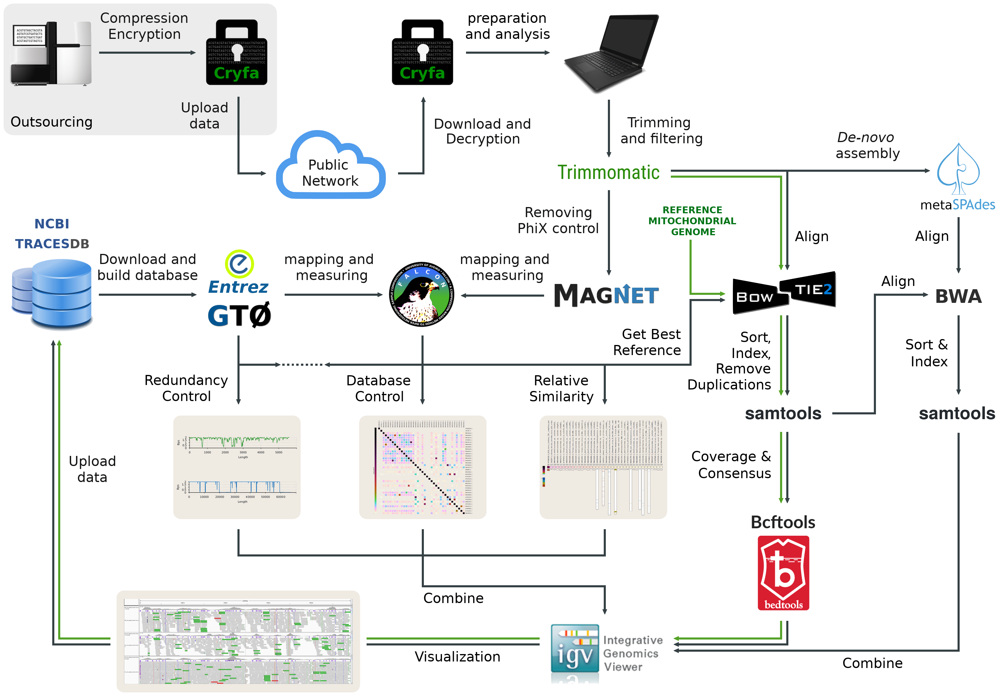

<div align="center">
  
[](LICENSE)
[](#)
[](#)
[](#)
[](#)
[](https://tinyurl.com/traces-pipe)
<!--[](https://travis-ci.org/pratas/traces)-->

</div>
<br>
<p align="center">
<br>
<i>A next-generation sequencing pipeline for identification, assembly,<br> and analysis of viral and human-host genomes at multi-organ level.</i>
<br><br>

## 1. About ##

TRACESPipe is a next-generation sequencing pipeline for identification, assembly, and analysis of viral and human-host genomes at multi-organ level. The identification and assembly of viral genomes rely on cooperation between three modalities:
<ul>
<li>compression-based predictors;</li>
<li>sequence alignments;</li>
<li><i>de-novo</i> assembly.</li>
</ul>
The compression-based prediction applies FALCON-meta technology with ultra-fast comparative quantification to find the best reference genome (from a large viral database) containing the highest similarity relative to the sequenced reads. After identification, the reads are aligned according to the best reference by Bowtie2. A consensus sequence is produced with specific filters using Bcftools. Then, <i>de-novo</i> assembly (metaSPAdes) is involved in building scaffolds. The high coverage scaffolds that overlap totally or partially the consensus sequence (aligned by bwa) are used to validate or either augment the new genome. The final analysis of the assembly is interactively supervised with the IGV with the goal of drafting the final sequence.

For the human-host variant call identification, the same procedure is followed although directly starting within the second point, given the use of the same reference (revised Cambridge Reference) to all the cases.

<br>
<p align="center">

</p>
<br>

The previous image shows the architecture of TRACESPipe, where the green line stands for the mitochondrial human line. This pipeline has been tested in Illumina HiSeq and NovaSeq platforms. The operating system required to run it is Linux. In windows use cygwin (https://www.cygwin.com/) and make sure that it is included in the installation: cmake, make, zcat, unzip, wget, tr, grep (and any dependencies). If you install the complete cygwin packet then all these will be installed. After, all steps will be the same as in Linux.

The TRACESPipe includes methods for ancient DNA authentication, namely using the quantification of damage (in the tips of the reads) relative to a reference. Other feature is the quantification of y-chromosome presence through compression-based predictors.

Additionally, the TRACESPipe includes read trimming and filtering, PhiX removal, and redundancy controls (at the Database level and for each candidate reference genomes) to improve the consistency and quality of the data.

## 2. Installation, Structure and Configuration ##

### 2.1 Installation ###

 is needed for installation.<br>
To install Conda use the following steps:
```
wget https://repo.anaconda.com/miniconda/Miniconda3-latest-Linux-x86_64.sh
bash Miniconda3-latest-Linux-x86_64.sh
```
Additional instructions can be found here:
```
https://docs.conda.io/projects/conda/en/latest/user-guide/install/linux.html
```
To install TRACESPipe, run the following commands in a Linux OS:
```
git clone https://github.com/viromelab/tracespipe.git
cd tracespipe/src/
chmod +x TRACES*.sh
./TRACESPipe.sh --install
```

### 2.2 Structure ###

In the tracespipe/ folder the following structure exists:
```bash
tracespipe/
│   
├── meta_data/         # information about the filenames in input_data/ and organ names
│   └── meta_info.txt  # see Configuration section for this file.
│   
├── input_data/        # where the NGS reads must be placed (and compressed with gzip)
│   
├── output_data/       # where the results will appear using the following subfolders: 
│   │
│   ├── TRACES_results/                # where the files regarding the metagenomic 
│   │                                  # analysis, redundancy and control will appear
│   │
│   ├── TRACES_viral_alignments/       # where viral alignments and index will appear
│   ├── TRACES_mtdna_alignments/       # where mtdna alignments and index will appear
│   ├── TRACES_specific_alignments/    # where specific alignments and index will appear
│   ├── TRACES_cy_alignments/          # where cy alignments and index will appear
│   │
│   ├── TRACES_viral_consensus/        # where viral consensus (FASTA) will appear
│   ├── TRACES_mtdna_consensus/        # where mtdna consensus (FASTA) will appear
│   ├── TRACES_specific_consensus/     # where specific consensus (FASTA) will appear
│   ├── TRACES_cy_consensus/           # where cy consensus (FASTA) will appear
│   │
│   ├── TRACES_viral_bed/              # where viral BED files will appear (SNPs and Coverage)
│   ├── TRACES_mtdna_bed/              # where mtdna BED files will appear (SNPs and Coverage)
│   ├── TRACES_specific_bed/           # where specific BED files will appear
│   ├── TRACES_cy_bed/                 # where cy BED files will appear (SNPs and Coverage)
│   │
│   ├── TRACES_viral_statistics/       # where viral statistics appear (depth/wide coverage)
│   ├── TRACES_mtdna_statistics/       # where mtdna statistics appear (depth/wide coverage)
│   ├── TRACES_specific_statistics/    # where specific statistics appear (depth/wide coverage)
│   ├── TRACES_cy_statistics/          # where cy statistics appear (depth/wide coverage)
│   │
│   ├── TRACES_mtdna_damage_<ORGAN>/   # where the mtdna damage estimation files will appear
│   │
│   ├── TRACES_denovo_<ORGAN>/         # where the output of de-novo assembly appears
│   │
│   └── TRACES_hybrid_<ORGAN>/         # where the hybrid data appears
│   
├── to_encrypt_data/    # where the NGS files to encrypt must be before encryption
├── encrypted_data/     # where the encrypted data will appear
├── decrypted_data/     # where the decrypted data will appear
│   
├── src/                # where the bash code is and where the commands must be call
│   
└── imgs/               # images related with the pipeline
```

### 2.3 Configuration ###

To configure TRACESPipe add your <b>FASTQ files gziped</b> at the folder
```
input_data/
```
Then, add a file exclusively with name <b>meta\_info.txt</b> at the folder
```
meta_data/
```
This file needs to specify the organ type (with a single word name) and the filenames for the paired end reads. An example of the content of meta\_info.txt is the following:
```
skin:V1_S44_R1_001.fastq.gz:V1_S44_R2_001.fastq.gz
brain:V2_S29_R1_001.fastq.gz:V2_S29_R2_001.fastq.gz
colon:V3_S45_R1_001.fastq.gz:V3_S45_R2_001.fastq.gz
```
Then, at the <b>src/</b> folder run:
```
./TRACESPipe.sh --get-all-aux
```

## 3. Running ##

To run TRACES Pipeline, use the following command:
```
./TRACESPipe.sh <parameters>
```
There are many parameters and configurations that can be used.<br>
See the next section for more information about the usage.

## 4. Usage ##

```
./TRACESPipe.sh -h
```

```      
                                                         
         ████████╗ ██████╗   █████╗   ██████╗ ███████╗ ███████╗   
         ╚══██╔══╝ ██╔══██╗ ██╔══██╗ ██╔════╝ ██╔════╝ ██╔════╝   
            ██║    ██████╔╝ ███████║ ██║      █████╗   ███████╗   
            ██║    ██╔══██╗ ██╔══██║ ██║      ██╔══╝   ╚════██║   
            ██║    ██║  ██║ ██║  ██║ ╚██████╗ ███████╗ ███████║   
            ╚═╝    ╚═╝  ╚═╝ ╚═╝  ╚═╝  ╚═════╝ ╚══════╝ ╚══════╝   
                                                                  
                             P I P E L I N E                            
                                                                
    A Next-generation sequencing pipeline for identification, assembly,
    and analysis of viral and human-host genomes at multi-organ level.
                                                                
    Usage: ./TRACESPipe.sh [options]                             
                                                                   
    -h,     --help            Show this help message and exit,     
    -v,     --version         Show the version and some information,  
    -f,     --force           Force running and overwrite of files,  
                                                                   
    -i,     --install         Installation of all the tools,       
                                                                   
    -gmt,   --get-max-threads Get the number of maximum machine threads,
    -t <THREADS>, --threads <THREADS>                              
                              Number of threads to use,            
                                                                   
    -dec,   --decrypt         Decrypt (all files in ../encrypted_data), 
    -enc,   --encrypt         Encrypt (all files in ../to_encrypt_data),
                                                                   
    -vdb,   --build-viral     Build viral database (all) [Recommended], 
    -vdbr,  --build-viral-r   Build viral database (references only),  
    -udb,   --build-unviral   Build non viral database (control),  
                                                                   
    -afs <FASTA> --add-fasta <FASTA>                               
                              Add a FASTA sequence to the VDB.fa,  
    -aes <ID>, --add-extra-seq <ID>                                
                              Add extra sequence to the VDB.fa,    
    -gx,    --get-extra-vir   Downloads/appends (VDB) extra viral seq, 
                                                                   
    -gad,   --gen-adapters    Generate FASTA file with adapters,   
    -gp,    --get-phix        Extracts PhiX genomes (Needs viral DB),  
    -gm,    --get-mito        Downloads human Mitochondrial genome,
    -gy,    --get-y-chromo    Downloads human Y-chromosome,        
    -gax,   --get-all-aux     Runs -gad -gp -gm -gy,               
                                                                   
    -rdup,  --remove-dup      Remove duplications (e.g. PCR dup),  
                                                                   
    -rm,    --run-meta        Run viral metagenomic identification,    
    -ro,    --run-meta-nv     Run NON-viral metagenomic identification,
                                                                  
    -rava,  --run-all-v-alig  Run all viral align/sort/consensus seqs, 
                                                                 
    -rb19,  --run-b19         Run B19   align and consensus seq,    
    -rh1,   --run-hv1         Run HHV1   align and consensus seq,    
    -rh2,   --run-hv2         Run HHV2   align and consensus seq,    
    -rh3,   --run-hv3         Run HHV3   align and consensus seq,    
    -rh4,   --run-hv4         Run HHV4   align and consensus seq,    
    -rh5,   --run-hv5         Run HHV5   align and consensus seq,    
    -rh6,   --run-hv6         Run HHV6   align and consensus seq,    
    -rh6a,  --run-hv6a        Run HHV6A  align and consensus seq,    
    -rh6b,  --run-hv6b        Run HHV6B  align and consensus seq,    
    -rh7,   --run-hv7         Run HHV7   align and consensus seq,    
    -rh8,   --run-hv8         Run HHV8   align and consensus seq,    
    -rh8,   --run-hv8         Run HHV8   align and consensus seq,    
    -rp1,   --run-poly1       Run Polyoma 1  align and consensus seq, 
    -rp2,   --run-poly2       Run Polyoma 2  align and consensus seq, 
    -rp3,   --run-poly3       Run Polyoma 3  align and consensus seq, 
    -rp4,   --run-poly4       Run Polyoma 4  align and consensus seq, 
    -rp5,   --run-poly5       Run Polyoma 5  align and consensus seq, 
    -rp6,   --run-poly6       Run Polyoma 6  align and consensus seq, 
    -rp7,   --run-poly7       Run Polyoma 7  align and consensus seq, 
    -rp8,   --run-poly8       Run Polyoma 8  align and consensus seq, 
    -rp9,   --run-poly9       Run Polyoma 9  align and consensus seq, 
    -rp10,  --run-poly10      Run Polyoma 10 align and consensus seq, 
    -rp11,  --run-poly11      Run Polyoma 11 align and consensus seq, 
    -rp12,  --run-poly12      Run Polyoma 12 align and consensus seq, 
    -rp13,  --run-poly13      Run Polyoma 13 align and consensus seq, 
    -rp14,  --run-poly14      Run Polyoma 14 align and consensus seq, 
    -rtt,   --run-ttv         Run TTV   align and consensus seq,    
    -rbv1,  --run-hbov1       Run HBoV1 align and consensus seq,    
    -rbv0,  --run-hbovnot1    Run HBoV (2,3,...) align/consensus seq, 
    -rhbv,  --run-hbv         Run HBV   align and consensus seq,    
    -rhpv,  --run-hpv         Run HPV   align and consensus seq,    
    -rvar,  --run-varv        Run VARV  align and consensus seq,    
    -rsv40, --run-sv40        Run Simian 40 align and consensus seq,  
    -rcuta, --run-cuta        Run Cutavirys align and consensus seq,  
    -rherv, --run-herv        Run H Endo Retro align and consensus seq,  
                                                                  
    -rsr <ID>, --run-specific <ID/PATTERN>                        
                              Run specific reference align/consensus, 
    -rsx <ID>, --run-extreme <ID/PATTERN>                            
                              Run specific reference align/consensys
                              using extreme sensitivity,            
                                                                 
    -rmt,   --run-mito        Run Mito align and consensus seq,   
    -rmtd,  --run-mito-dam    Run Mito damage only,               
                                                                 
    -rya,   --run-cy-align    Run CY align and consensus seq,    
    -ryq,   --run-cy-quant    Estimate the quantity of CY DNA,    
                                                                  
    -rda,   --run-de-novo     Run de-novo assembly,               
                                                                  
    -rhyb,  --run-hybrid      Run hybrid assembly (align/de-novo), 
                                                                  
    -vis,   --visual-align    Run Visualization tool for alignments, 
    -covl,  --coverage-latex  Run coverage table in Latex format,   
    -covc,  --coverage-csv    Run coverage table in CSV format,    
    -covp,  --coverage-profile <BED_NAME_FILE>                      
                              Run coverage profile for specific BED file, 
                                                                  
    -ra,    --run-analysis    Run data analysis,                   
    -all,   --run-all         Run all the options.                 
                                                                
    Example: ./TRACESPipe.sh --run-meta --run-b19 --run-mito 
                                                                
    Add the file meta_info.txt at ../meta_data/ folder. Example:      
    meta_info.txt -> 'organ:reads_forward.fa.gz:reads_reverse.fa.gz'  
    The reads must be GZIPed in the ../input_data/ folder.            
    The output results are at ../output_data/ folder.                 
                                                                
    Contact: projectraces@gmail.com   

```

## 5. Examples ##

### 5.1 Building a Parvovirus consensus sequence (if exists in the FASTQ samples): ###
```
./TRACESPipe.sh --run-meta --run-b19
```
The output consensus sequence is included at 
```
output_data/TRACES_viral_consensus
```
while the alignments at
```
output_data/TRACES_viral_alignments
```
and the BED files at
```
output_data/TRACES_viral_bed
```

### 5.2 Building a mitochondrial consensus sequence (if exists in the FASTQ samples): ###

```
./TRACESPipe.sh --run-mito
```
The output consensus sequence is included at
```
output_data/TRACES_mtdna_consensus
```
while the alignments at
```
output_data/TRACES_mtdna_alignments
```
and the BED files at
```
output_data/TRACES_mtdna_bed
```

### 5.3 Encrypt and Decrypt NGS data: ###

TRACESPipe supports secure encryption of genomic data. This allows outsourcing of the sequencing service while maintaining secure transmission and storage of the files.

#### 5.3.1 Encrypt #### 

Place the files from sequencing (e.g. FASTQ gziped files) in the folder <b>to_encrypt_data</b> and, then, run:
```
./TRACESPipe.sh --encrypt
```
Insert a strong password.<br>
The encrypted files are in the <b>encrypted_data</b> folder.

#### 5.3.2 Decrypt #### 

Place the encrypted files in the folder <b>encrypted_data</b> and, then, run:
```
./TRACESPipe.sh --decrypt
```
Insert the password that has been used in encryption.<br>
The decrypted files are in the <b>decrypted_data</b> folder.

### 5.4 Run all viral genome alignments, variation, and consensus sequences: ###

```
./TRACESPipe.sh --run-meta --run-all-v-alig
```
The output consensus sequence is included at
```
output_data/TRACES_viral_consensus
```
while the alignments at
```
output_data/TRACES_viral_alignments
```
and the BED files at
```
output_data/TRACES_viral_bed
```

### 5.5 Quantify the presence of y-chromosome: ###

```
./TRACESPipe.sh --run-cy-quant
```
The output quantify is included at
```
output_data/TRACES_results/REP_CY_<organ_name>.txt
```

### 5.6 Full viral metagenomic composition for all the organs: ###

```
./TRACESPipe.sh --run-meta
```
The output is included at
```
../output_data/TRACES_results/REPORT_META_VIRAL_ALL.txt
```

### 5.7 Run NON viral metagenomic composition for all the organs (fungi, archaea, etc): ###

```
./TRACESPipe.sh --run-meta-nv
```
The output is included at
```
../output_data/TRACES_results/REPORT_META_NON_VIRAL_<organ_name>.txt
```

### 5.8 Run de-novo assembly (all data): ###

```
./TRACESPipe.sh --run-de-novo
```
The output is included at
```
../output_data/TRACES_denovo_<organ_name>
```

### 5.9 Run specific viral alignment for all organs using extreme sensitivity: ###

```
./TRACESPipe.sh --run-extreme
```
The output is included at
```
../output_data/TRACES_specific_alignments
```

### 5.10 Evaluate damage of mitochondrial DNA ###

```
./TRACESPipe.sh --run-mito-dam
```
The output is included at
```
../output_data/TRACES_mtdna_damage_<organ_name>
```

## 6. Programs ##

TRACES Pipeline uses a combination of the following tools:

| Tool | URL | Article |
| --- | --- | --- |
| &#x1F49A;&nbsp; Cryfa | [[https://github.com/cobilab/cryfa]](https://github.com/cobilab/cryfa) | [](https://doi.org/10.1093/bioinformatics/bty645) |
| &#x1F49A;&nbsp; Entrez | [[https://www.ncbi.nlm.nih.gov/genome]](https://www.ncbi.nlm.nih.gov/genome) | [](https://dx.doi.org/10.1093%2Fnar%2Fgks1189) |
| &#x1F49A;&nbsp; GTO | [[https://github.com/cobilab/gto]](https://github.com/cobilab/gto) | [](https://doi.org/10.1101/2020.01.07.882845) |
| &#x1F49A;&nbsp; Trimmomatic | [[http://www.usadellab.org/cms/?page=trimmomatic]](http://www.usadellab.org/cms/?page=trimmomatic) | [](https://academic.oup.com/bioinformatics/article/30/15/2114/2390096) |
| &#x1F49A;&nbsp; MAGNET | [[https://github.com/cobilab/magnet]](https://github.com/cobilab/magnet) | [](https://www.eurasip.org/Proceedings/Eusipco/Eusipco2018/papers/1570439333.pdf) |
| &#x1F49A;&nbsp; FALCON-meta | [[https://github.com/cobilab/falcon]](https://github.com/cobilab/falcon) | [](https://www.mdpi.com/2073-4425/9/9/445) |
| &#x1F49A;&nbsp; Bowtie2 | [[http://bowtie-bio.sourceforge.net/bowtie2]](http://bowtie-bio.sourceforge.net/bowtie2) | []( https://www.nature.com/articles/nmeth.1923) |
| &#x1F49A;&nbsp; Bwa | [[http://bio-bwa.sourceforge.net/]](http://bio-bwa.sourceforge.net/) | [](https://academic.oup.com/bioinformatics/article/26/5/589/211735) |
| &#x1F49A;&nbsp; metaSPAdes | [[http://cab.spbu.ru/software/meta-spades/]](http://cab.spbu.ru/software/meta-spades/) | [](https://www.liebertpub.com/doi/full/10.1089/cmb.2012.0021) | 
| &#x1F49A;&nbsp; Samtools | [[http://samtools.sourceforge.net/]](http://samtools.sourceforge.net/) | [](https://academic.oup.com/bioinformatics/article/25/16/2078/204688) | 
| &#x1F49A;&nbsp; Bcftools | [[http://www.htslib.org/doc/bcftools.html]](http://www.htslib.org/doc/bcftools.html) | [](https://academic.oup.com/bioinformatics/article/27/21/2987/217423) |
| &#x1F49A;&nbsp; Tabix | [[http://htslib.org/doc/tabix.html]](http://htslib.org/doc/tabix.html) | [](https://academic.oup.com/bioinformatics/article/27/5/718/262743) |
| &#x1F49A;&nbsp; BEDtools | [[https://bedtools.readthedocs.io/en/latest/]](https://bedtools.readthedocs.io/en/latest/) | [](https://currentprotocols.onlinelibrary.wiley.com/doi/abs/10.1002/0471250953.bi1112s47) |
| &#x1F49A;&nbsp; IGV | [[https://software.broadinstitute.org/software/igv/]](https://software.broadinstitute.org/software/igv/) | [](https://www.nature.com/articles/nbt.1754) |
| &#x1F49A;&nbsp; mapDamage2 | [[https://ginolhac.github.io/mapDamage/]](https://ginolhac.github.io/mapDamage/) | [](https://academic.oup.com/bioinformatics/article/29/13/1682/184965) |


## 7. Citation ##

If you use this pipeline, please cite:
```
[Manuscript in preparation]
```

## 8. Issues ##

For any issue let us know at [issues link](https://github.com/pratas/traces/issues).

## 9. License ##

GPL v3.

For more information see LICENSE file or visit
<pre>http://www.gnu.org/licenses/gpl-3.0.html</pre>

